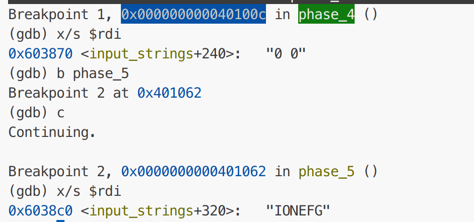

origin_readme：This is an x86-64 bomb for self-study students. 

### 我的bomb实验解题思路

#### (0) 前置知识
**汇编语言、gdb调试、逆向工程**

#### (1) bomb_1

通过汇编代码判断出答案字符串的长度及起始地址即可，**核心理解函数：string_length()和string_not_equal()**.

#### (2) bomb_2

理解**sscanf()函数和read_six_numbers()**的工作原理，然后判断字符串至少包含的整型个数，然后分析phase_2的工作逻辑即可，是一个判断后面整数是前面两倍的逻辑.

read_six_numbers()将sscanf得到的nums放入当前的rsp起点的4字节数组中  
sscanf()需要一个格式字符串(存在地址%rsi)与一个输入字符串(存在地址%rdi中)

#### (3) bomb_3

依旧是考察**sscanf()函数**的工作原理，分析phase_3的工作逻辑即可，是先确定第一个整型的范围，发现是个小范围，对于每个可能取值，汇编代码中均有跳转，每个跳转会得到第二个整型.

#### (4) bomb_4

考察**逆向工程**和**sscanf()函数**和**函数参数理解**，其中第二个整型直接判断出是0，第一个整型需要在一个复杂的数学函数逻辑中给出判断，即**func4()**，逆向出func4()即可判断第一个整型的范围了.

#### (5) bomb_5

整体流程思路回归到(1)，即在其基础上不是单纯比较input_str 和 ans_str，而是将input_str 的值先映射到另一个字符串，
得到一个新的字符串，input_reflect，再比较input_reflect和ans_str，**核心理解函数：string_length()和string_not_equal()**.

#### (6) bomb_6

~~unfinished!~~

确定6个数，且6个数互不相同，且 0 < x <= 6，故是1,2,3,4,5,6的排列，通过链表排序得到答案.

#### (7) secret_bomb

~~unfinished!~~

进入方式：最后的一个phase_defused中进入，要求inputs_str + 240 通过 sscanf()转化为"%d %d %s"格式

发现每个phase阶段input_strings的位置都会移动，而input_strings + 240对应phase_4的输入，故对phase_4的输入修改即可.

发现phase_4中添加的字符串应该为"DrEvil"

