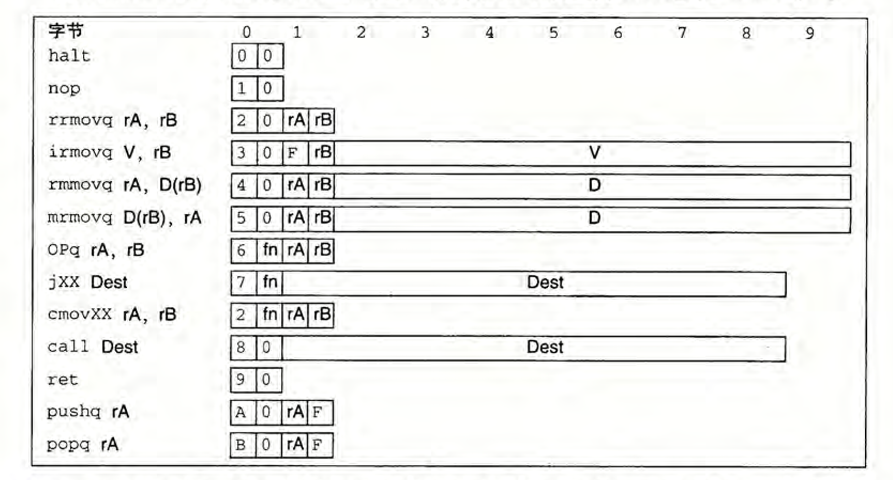

### SEQ阶段实现的练习题



#### 4.19

```py
bool need_valC = icode in {IIRMOVQ,IRMMOVQ,IMRMOVQ,IJXX,ICALL};
```

#### 4.20

```py
# symbol "XXX" mean the ans which I forgot in my ans
word srcB = [
    icode in {IRMMOVQ, IMRMOVQ, "IOPQ"} : rB;
    icode in {IPOPQ, "IPUSHQ", "ICALL", "IRET"} : RRSP
    1 : RNONE   # Don't need register
];
```

#### 4.21

```py
word destM = [
    icode in {IMRMOVQ, IPOPQ}  : rA;
    1 : RNONE;  # Don't need register
];
```

#### 4.22

```py
因为popq %rsp指令等价于 [%rsp] -> %rsp，
故内存写入寄存器的优先级大，valM的值优先，即M端口的优先值大s
```

#### 4.23

```py
word aluB = [
    icode in {IRRMOVQ, IOPQ, IRMMOVQ, IMRMOVQ} : valB;
    icode in {IIRMOVQ} : 0;
    icode in {ICALL, IPUSHQ} : -8;
    icode in {IRET, IPOPQ} : 8;
    # Other instruction don't need ALU
]

# 正确答案
ans:
word aluB = [
    icode in {IOPQ, IRMMOVQ, IMRMOVQ, ICALL, IPUSHQ, IRET, IPOPQ} : valB;
    icode in {IIRMOVQ, IRRMOVQ} : 0;
    # Other instruction don't need ALU
]
```

#### 4.24

```py
cmovxxx
word dstE = [
    icode in {IRRMOVQ} && Cnd : rB # 一般情况下cond = true，但不满足时Cnd = false，则不传送
    icode in {IIRMOVQ, IOPQ} : rB;
    icode in {IPUSHQ, IPOPQ, ICALL, IRET} : RRSP;
    1 : RNONE;
]
```

#### 4.25

```py
word mem_data = [
    icode in {IRMMOVQ, IPUSHQ} : valA;
    icode in {ICALL} : valP;
]
```

#### 4.26

```py
bool mem_write = icode in {IRMMOVQ, IPUSHQ, ICALL};
```

#### 4.27

```py
word Stat = [
    imem_error || dmem_error : SADR;
    !instr_valid : SINS;
    icode == IHALT : SHLT;
    1 : SAOK;
]
```